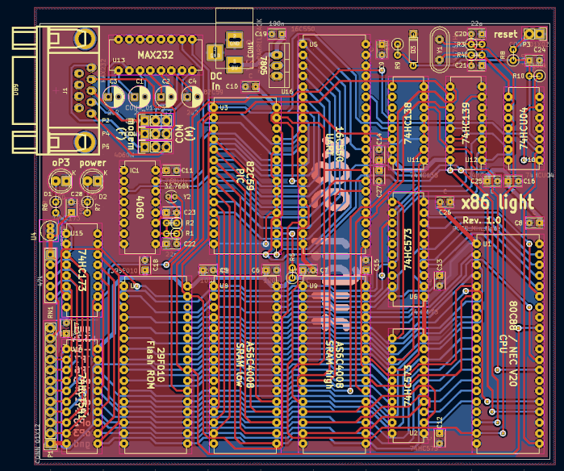
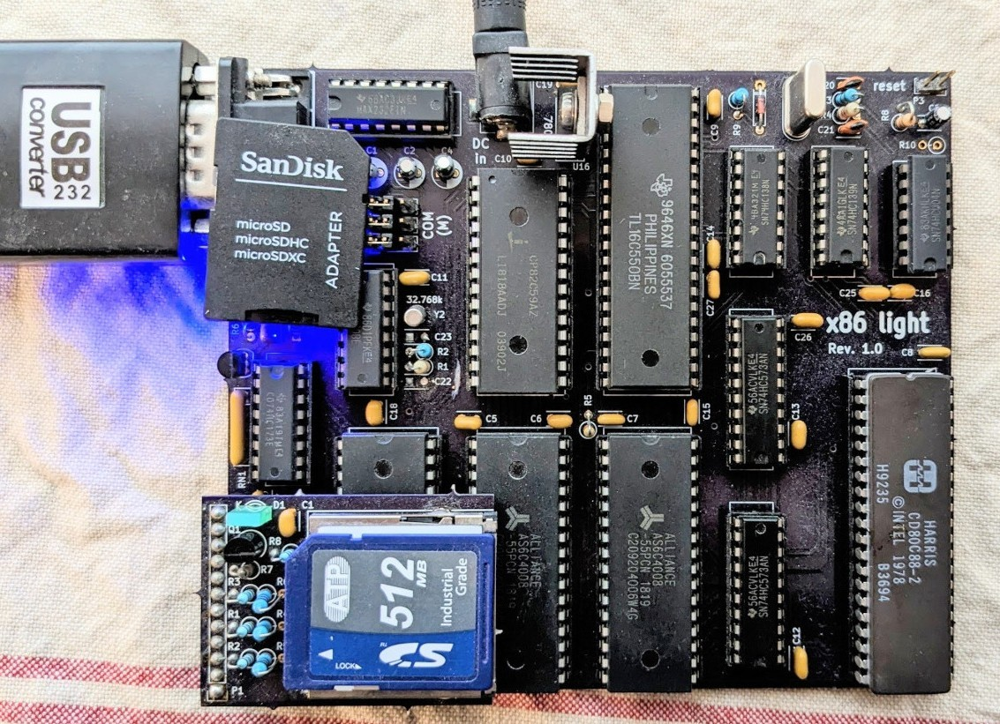
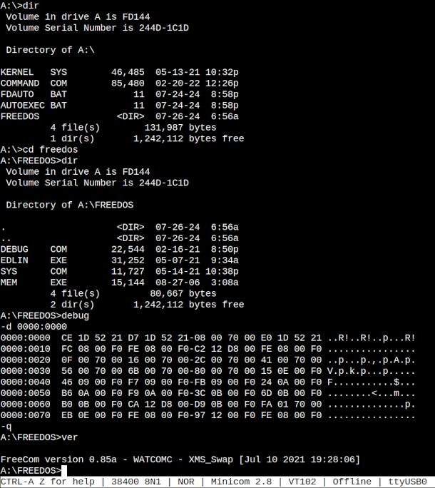

# 8088-ROM

This is a DIY x86 single board computer and ROM BIOS, capable of booting into [FreeDOS](https://www.freedos.org/). 
The board is equipped with an 80C88 (or any compatible) CPU running at 3.6864MHz, 1MB SRAM, 128kB in-system programmable BIOS EEPROM, an RS232 compatible serial port (16C550B UART at IRQ7), two fixed time interval sources: 32kHz (IRQ5) and 2Hz (IRQ4), a 4-bit I/O port, SPI and SD-card interfaces and an 82C59A programmable interrupt controller.

## [Schematics (pdf)](schematics.pdf) <--

Standard BIOS INT 10h and INT 16h calls are re-routed to the UART, which is the default character I/O device for this system.

### SD card interface:
A software bit-banged SPI bus is implemented on top of the I/O port and the BIOS has all the routines to access the SD card through SPI bus. On startup, the BIOS checks for the presence of an SD card and tries to find a valid MS-DOS partition on it. Once it finds a valid partition that has the exact size of 1.44MB, it gives access to it via standard BIOS INT 13h calls, just as if it was an actual 1.44MB floppy disk. Subsequently, a standard IBM PC compatible OS boot process can take place.

The position-independent BIOS ROM code can be copied to RAM and the system can continue the execution from RAM; 64k binary blocks can be downloaded to RAM via the UART and the system can jump into this block, as well as the contents of any RAM segment can be directly burnt into the on-board EEPROM. These features together enable the development and debugging of the ROM code without any external EEPROM burner device.

## Memory Map

|Range             |    Area Description   |   Size    |     Limitis  |
|------------------|-----------------------|-----------|--------------|
|0x00000-0x003FF   |     Interrupt vectors |   1k      | 0 - 1k       |
|0x00400-0x004FF   |     BIOS data area    |   256b    | 1k - 1.25k   |
|0x00500-0xDF000   |     free RAM area     | 890.75k   | 1.25k - 892k |
|0xDF000-0xDFFFF   |     BIOS BSS RAM      |     4k    | 892k - 896k  |
|0xE0000-0xEFFFF   |     BIOS ROM L        |    64k    | 896k - 960k  |
|0xF0000-0xFFFFF   |     BIOS ROM H        |    64k    | 960k - 1024k |

## BIOS cpu configuration:

|Register|Value      |
|--------|-----------|
|DS      |0xDF00     |
|SP      |0xDF00:1000|

## Toolchain
https://sourcery.mentor.com/GNUToolchain/release3298

minipro -p SST39SF010A -w ./minipro.bin

