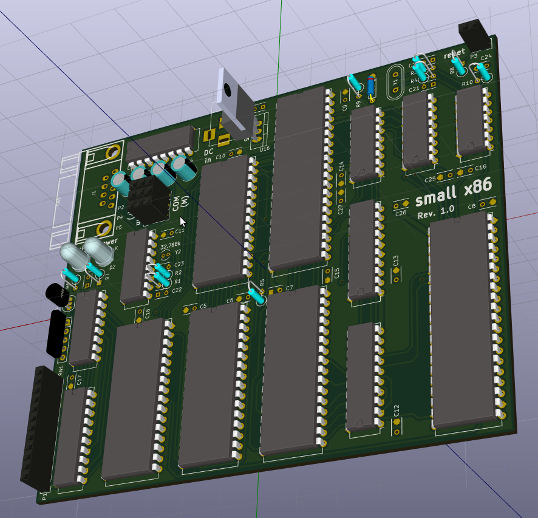

# 8088-ROM
ROM BIOS for 8088

This is a ROM BIOS for a 8088 single board computer. It resides in the upper 64k of the ROM and the CPU starts executing it at startup.
The board features a 16550 UART (IRQ7), two periodical time sources: 32kHz (IRQ5) and 2Hz (IRQ4), a 4-bit I/O port, 1Mb SRAM and 128k EEPROM.

Standard I/O calls (INT 10h and INT 16h) are re-routed to the UART, which is the default I/O device for this system.

The board supports **SD card** as a storage media:
A software SPI bus is implemented on top of the I/O port and the ROM has all the routines to access the SD card through SPI bus. On startup, the BIOS checks for the presence of an SD card and tries to find a valid MS-DOS partition on it. Once it finds a valid partition that has the exact size of 1.44Mb, it gives access to it via the IBM PC standard INT 13h calls, just as if the 1.44Mb partition on the SD card was an actual 1.44Mb floppy disk.

BIOS features include the ability to move the contents of the BIOS ROM to RAM and restart the execution from RAM, the ability to receive 64k binary blocks via the UART, place them into RAM and execute them, as well as burn the contents of a RAM segment into the EEPROM. These features together enable the development of the software wihtout the need of any external EEPROM burner device.

F000:0000 - F000:FFFF

## Toolchain
https://sourcery.mentor.com/GNUToolchain/release3298

